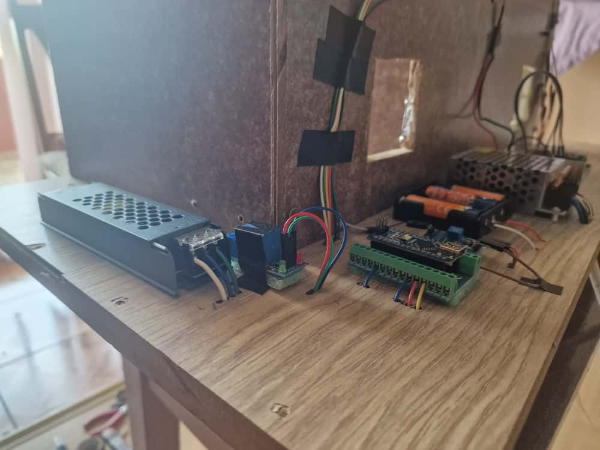
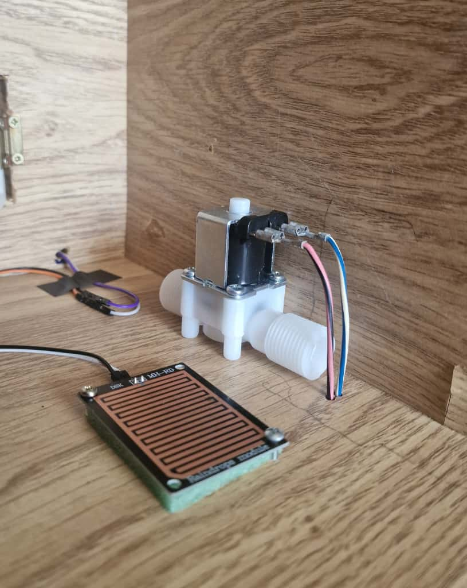
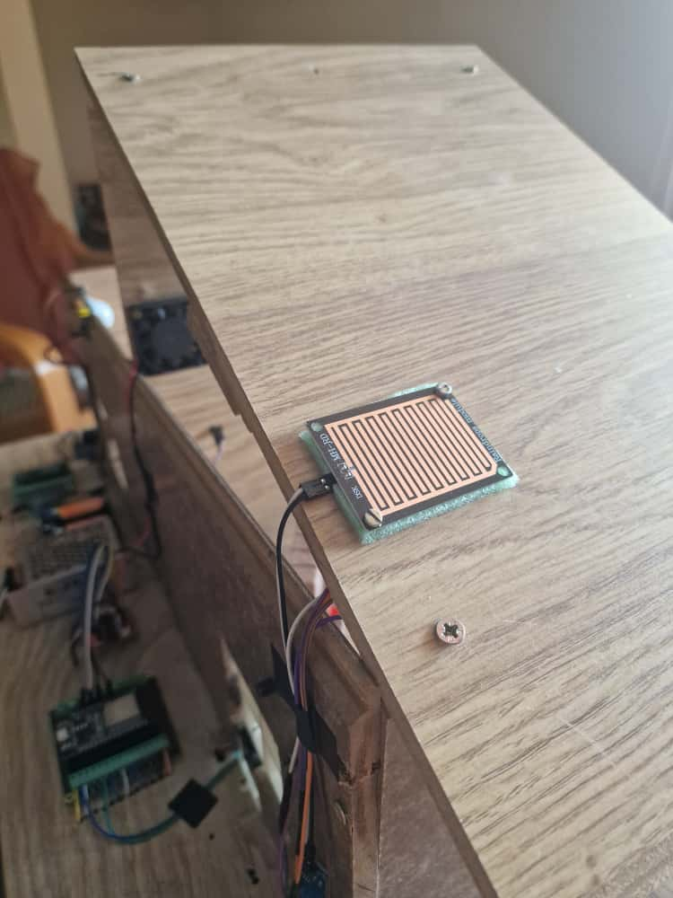
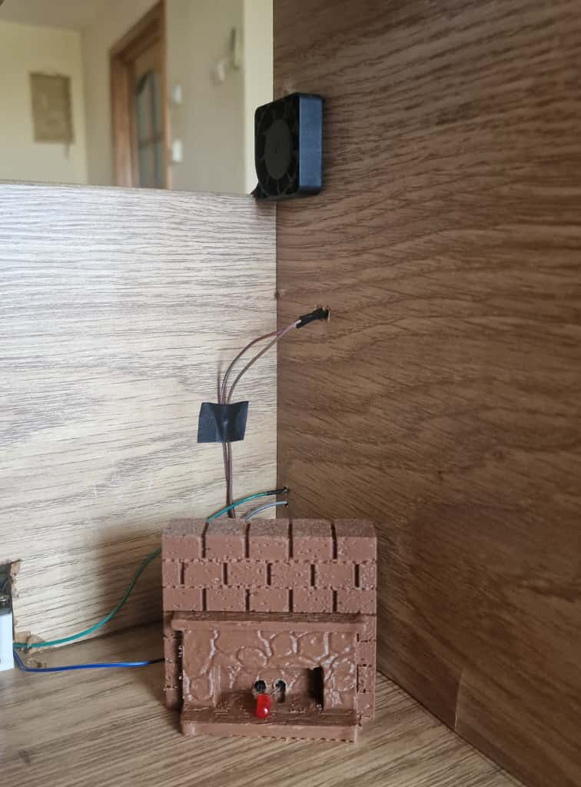
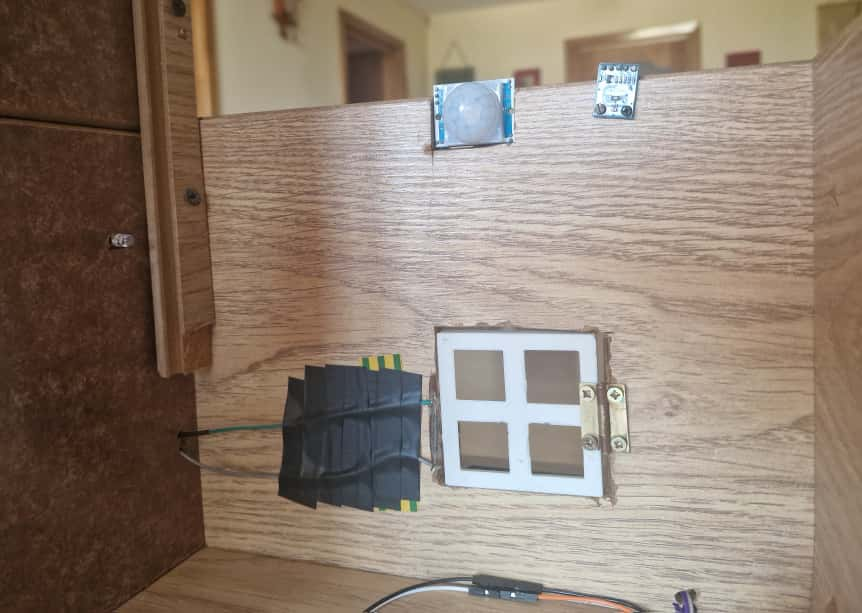
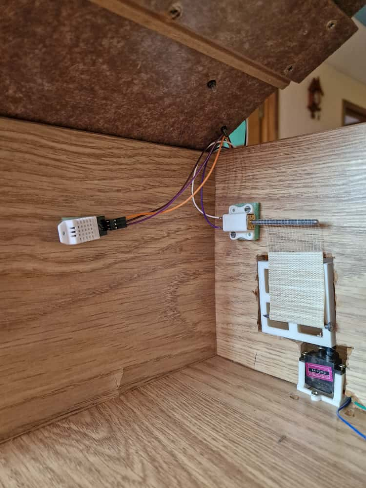
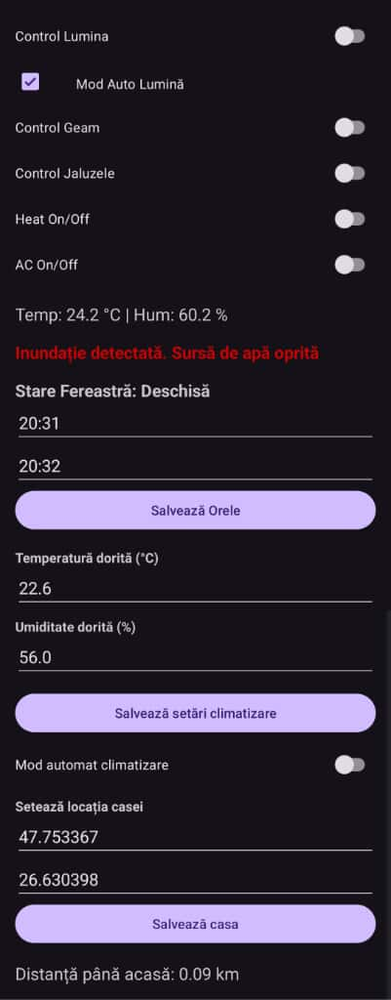

# 🏠 Smart Home IoT System (ESP32 + Android + Firebase)

An IoT home automation system built from scratch using **ESP32**, **Firebase**, and a custom **Android mobile app**.  
The system integrates sensors, relays, and actuators to control household devices intelligently and safely.

-----

## 🚀 Overview
This project automates and monitors a small home environment through an ESP32 microcontroller connected to sensors and a Firebase real-time database.  
The mobile app allows users to remotely control devices such as the AC, the heat, a window, and LED lighting, while also receiving real-time status updates.

---

## 🧩 Features

- **Flood Detection:** Automatically cuts off the water source when floods are detected.  

- **Rain Detection:** Automatically close the window in case of rain. The window can be controlled also from the app.

- **Blinds Control:** Blinds can be controlled from the app. Also, the user can set the time when the blinds open/close.

- **Intrusion Detection:** Detect any unknown window opening and send a push notification on the phone.

- **Motion-Based LED Control:** Uses a PIR sensor, a light intensity sensor and PWM brightness control via `analogWrite()`

- **Temperature & Humidity Monitoring:** Activates the AC or the heat when thresholds are exceeded only when the user is getting close to the home. Manual control avalable

- **Android App Integration:** Wi-Fi communication between the ESP32 and a custom Android app using Firebase.  

- **Modular Code Design:** Each functionality (window control, LED, sensors) is implemented in a separate file for scalability.

---

## 🛠️ Hardware Components

| Component | Description |
|------------|-------------|
| ESP32 Dev Board | Main controller with Wi-Fi and Bluetooth |
| Relay Module (5V, Low-Level) | Controls 12V solenoid valve |
| Solenoid Valve (12V NO) | Controls water flow |
| Rain & Flood Sensors | Detect water presence |
| Temperature and Humidity sensor | Real time data |
| DC Motor, Servomotor | Blinds, Window control |
| PIR Sensor | Detects motion |
| LEDs | light/heat simulation |
| 12V Fan | Activates on temperature threshold |
| Power Supply 5V/12V | Provides system power |

---

## 💻 Software Architecture

- **ESP32 Firmware:** Written in C++ (Arduino IDE)

- **Android App:** Built in Android Studio using Java

- **Database:** Firebase Realtime Database  

- **Design Pattern:** Modular, non-blocking code

- **Version Control:** Git + GitHub  

---

## 📲 Android App

- Sends commands and receives real-time updates from the ESP32 via Firebase.  
- Provides UI for monitoring sensors and manually controlling devices.  
- Sends push notifications on critical events (e.g., flood detected).

---

## 📸 Project Demo

Below are photos showcasing the prototype and main functionalities of the system:

**Power Supply**

**Flood Detection and Valve Control**
Automatically closes the solenoid valve when water is detected.

**Rain Detector**
Automatically closes the window in case of rain.

**Temperature & Humidity Control**
Activates the fan or heating system based on sensor thresholds.

**Motion Detection with LED Control**
Detects movement and adjusts LED brightness via PWM.

**Automate Blinds**
Open/Close the blinds based on android app signal.

**Android App Interface**
Custom-built Android app for real-time monitoring and manual control via Firebase.

*Full video demonstration available upon request or upcoming on YouTube.*

---

## ⚡ How to Run

1. Clone the repository

2. Open the ESP32 folder in Arduino IDE.

3. Update your Wi-Fi credentials and Firebase API details in the config file.

4. Flash the code to the ESP32.

5. Open the SmartHomeApp project in Android Studio and connect your Firebase instance.

6. Run the app on your device and control your home remotely!